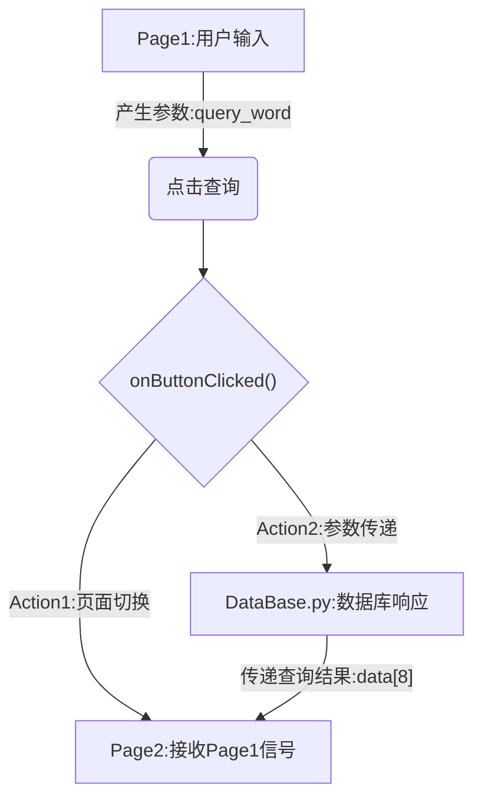
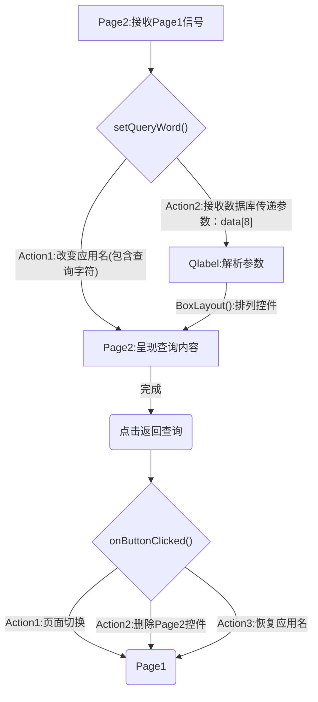
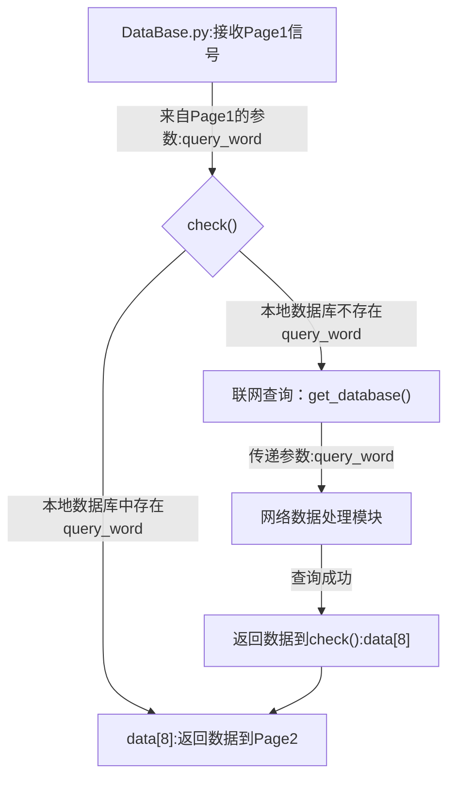
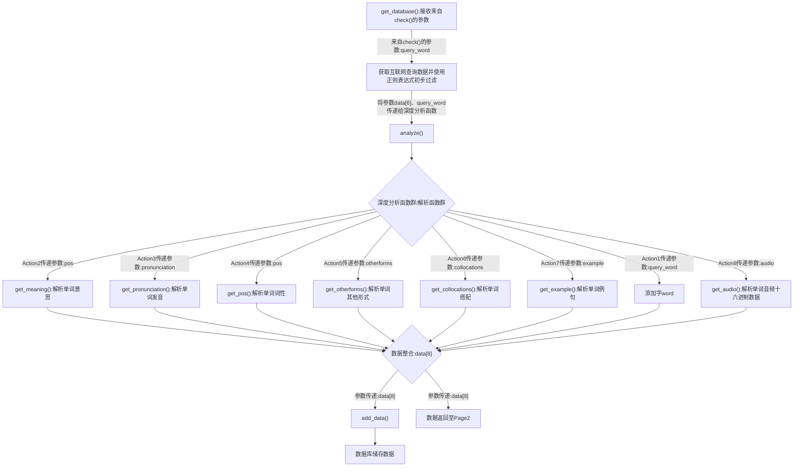

# 项目介绍说明
## 软件环境
- `PyQt5`
- `Anaconda Python 3.8.15`
- `SQLite`
- `Pycharm 2022`
## 项目贡献者
- [李锦川](https://github.com/SoDebug)
- [项宇星](https://github.com/lamfls)
- [黄志杰](https://github.com/jazz6699)
- [王倩](https://github.com/7Kuku7)
## 项目实现框图
 

## 各部分模块详解
### 主程序【`main.py`】

- `UI`结构

    1) 使用 `PyQt5` 中的 `QStackedWidget` 容器窗口的特殊性，可以在其中堆叠多个小部件，不过只能显示其中一个小部件。 实现多页面功能（Page1和Page2）
    2) 其中`Page1`包含输入框和查询按钮，`Page2`包含查询的结果。

- `Page1`实现内容

    1) 输入框使用 QLineEdit 类创建:```self.lineedit = QLineEdit(self)```

    2) 按钮使用 QPushButton 类创建:```self.button = QPushButton("查询", self)```

    3) 为按钮设置点击信号和槽函数,同时捕获用户的输入，传递到`Page2`

    ```
    def onButtonClicked(self):
        # 获取输入的内容
        query_word = self.lineedit.text()
        # 设置当前显示的小部件为第二页
        stacked_widget.setCurrentIndex(1)
        # 将输入的内容传递到第二页
        page2.setQueryWord(query_word)
    ```
  
- `Page2`实现内容,并将应用名改变
    1) 接收来自`Page1`的输入字符:

    ```
    def setQueryWord(self, query_word):
        self.query_word = query_word
        self.parent().setWindowTitle("Dictionary - " + query_word)
    ```

    2) 将`Page1`查询结果刻化为不同的部件，显示在`Page2`中(使用`QV/QH`布局管理器管理)
    ```
    def setQueryWord(self, query_word):
        word, pronunciation, pos, otherforms, collocations, example = data 
        self.word = QLabel()
        self.word.setText("【单词】：" + word)
        ...            
        layout = QVBoxLayout()
        layout.addWidget(self.word)
    ```

- 布局管理器`QHBoxLayout()&QVBoxLayout()`

    1) `QVBoxLayout()`竖直布局管理器，在其中的控件均以铅锤（纵向）方式排列

    ```
    # 创建 QVBoxLayout 布局管理器
    layout_v = QVBoxLayout()
    # 将控件word加入QVBoxLayout布局管理器中
    layout_v.addWidget(self.word)
    # 使布局管理器显示在Page的布局中
    self.setLayout(layout_v)
    ```
    
    2) `QHBoxLayout()`水平布局管理器，在其中的控件均以水平（横向）方式排列

    ```
    # 创建 QHBoxLayout 布局管理器
    layout_h = QHBoxLayout()
    # 将控件word加入QHBoxLayout布局管理器中
    h_layout.addWidget(self.button)
    # QHBoxLayout 布局管理器 放入 QVBoxLayout 布局管理器 中
    layout.addLayout(h_layout)
    ```
  
- 控件位置设置

    1) 使用`move(x,y)`控制控件显示位置
    
    ```
    self.lineedit.move(90, 150)
    ```

    2) 使用`QHBoxLayout()/QVBoxLayout()`控制控件显示位置
    
    ```
    # 创建 QVBoxLayout 布局管理器
    layout_v = QVBoxLayout()
    # 将控件word加入QVBoxLayout布局管理器中
    layout_v.addWidget(self.word)
    # 使布局管理器显示在Page的布局中
    self.setLayout(layout_v)
    ```

    3) 使用`setGeometry(x,y,w,h)`控制控件显示位置    

    ```
    self.lineedit.setGeometry(50,120,40,20)
    ```

- Page1逻辑框图呈现



- Page2逻辑框图呈现



- 数据库处理模块逻辑框图



- 网络数据处理模块(requests & re)逻辑框图




## 软件界面UI展示
第一页

 
 
第二页

 
 
## 软件打包
- 使用`pyinstaller`打包，运行命令`pip install pyinstaller`以安装`pyinstaller`
- 打包命令```pyinstaller -F -w main.py --add-data database.db;.```
- 注意事项：本软件需要从外部访问数据库`database.db`,如果软件运行目录下无该数据库可能会引发闪退，~~因为目前暂未完善从网络中获取查询结果~~